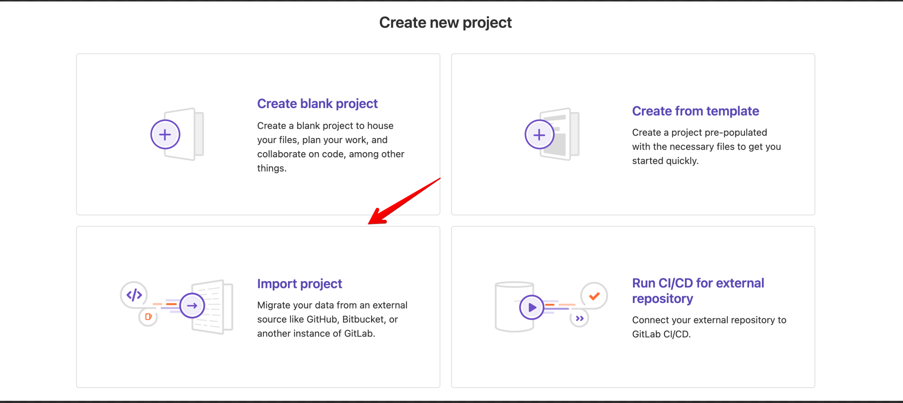
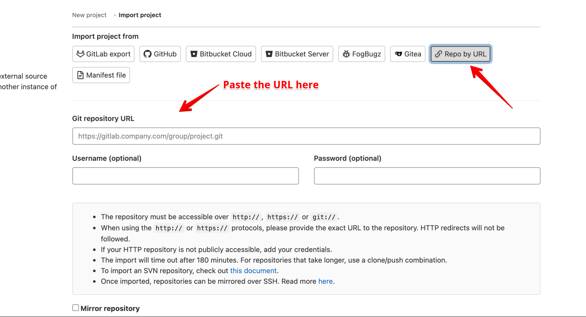
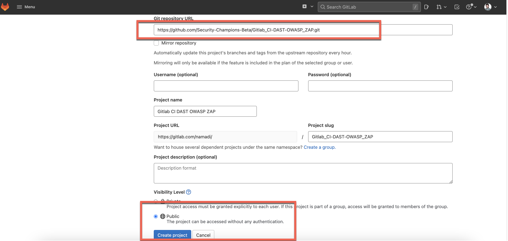
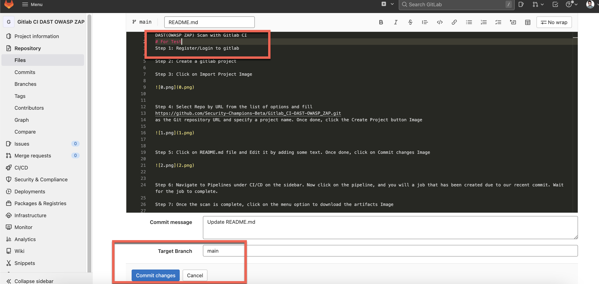
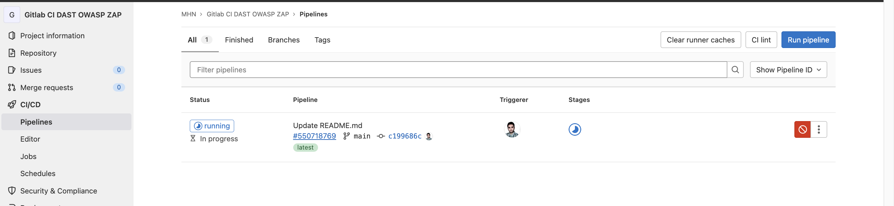
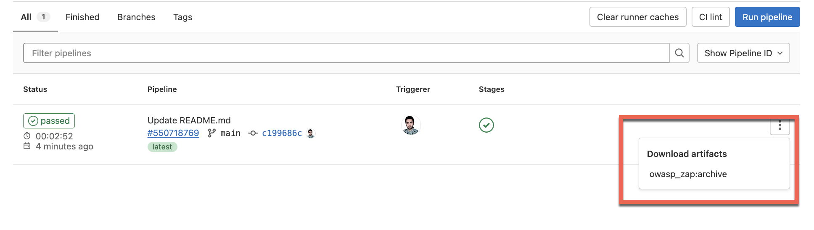
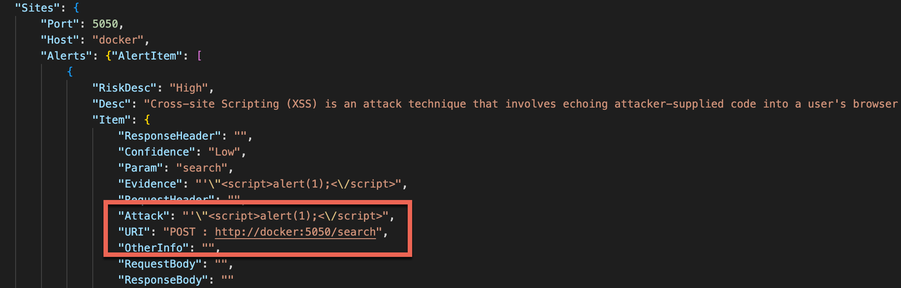
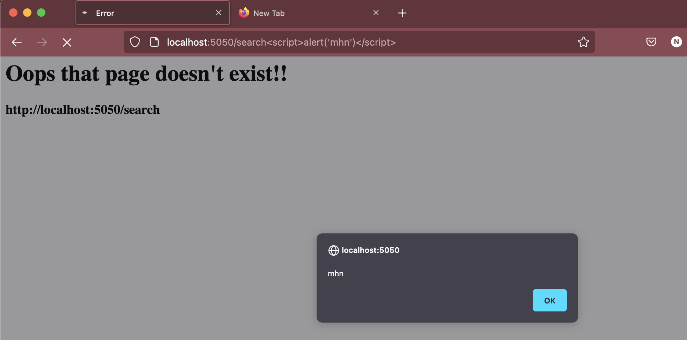

DAST(OWASP ZAP) Scan with Gitlab CI

Step 1: Register/Login to gitlab

Step 2: Create a gitlab project

Step 3: Click on Import Project Image

Step 4: Select Repo by URL from the list of options and fill 
https://github.com/Security-Champions-Beta/Gitlab_CI-DAST-OWASP_ZAP.git
as the Git repository URL and specify a project name. Once done, click the Create Project button Image

Step 5: Click on README.md file and Edit it by adding some text. Once done, click on Commit changes Image

Step 6: Navigate to Pipelines under CI/CD on the sidebar. Now click on the pipeline, and you will a job that has been created due to our recent commit. Wait for the job to complete.

Step 7: Once the scan is complete, click on the menu option to download the artifacts Image

Step 8 : Read OwaspZap report

Step 9 : Verify on Docker

